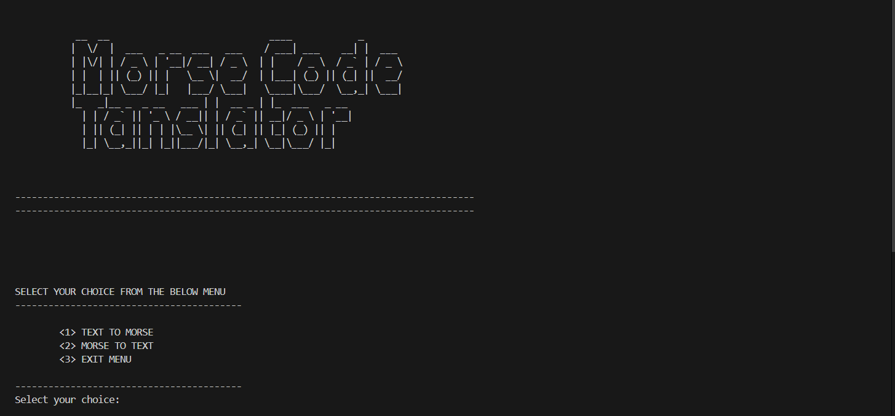
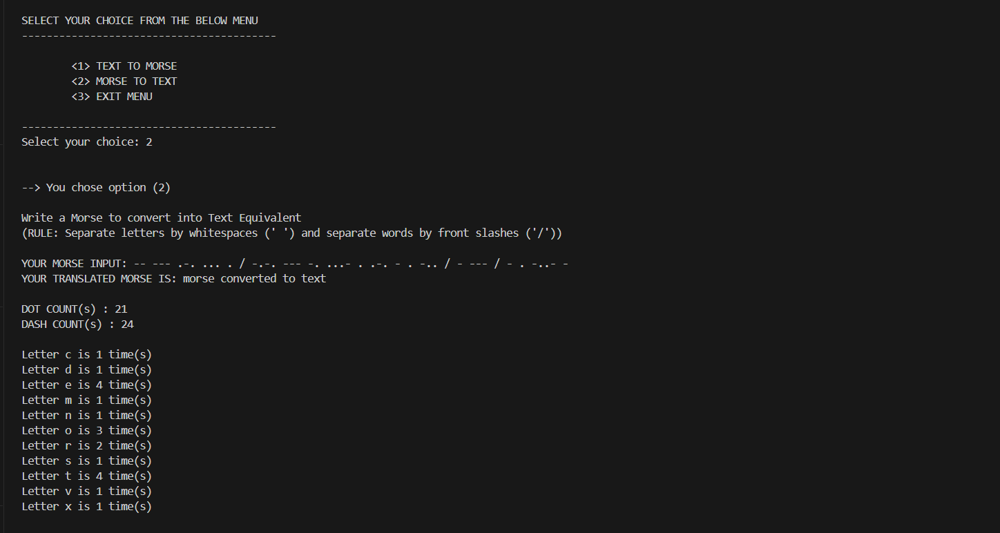
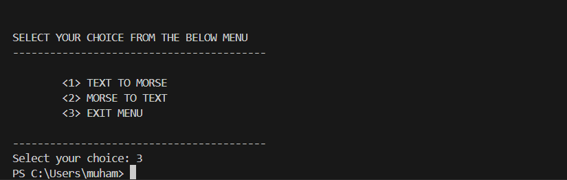
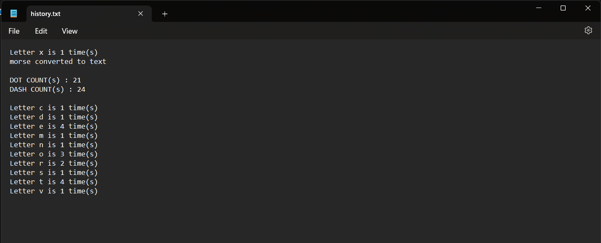

# MORSE CODE TRANSLATOR

## About
MORSE is a command-line program that translates text to Morse code and vice versa. It also saves a history of operations in a file named `history.txt`.

### Author
Muhammad Ibrahim Shoeb  
BSc in Computer Science Engineering  
NEPTUN: OZLVV3

## How It Works
- **Encoding**: Converts Latin text into Morse code.
- **Decoding**: Converts Morse code back into Latin text.
- The program records statistics about the number of dots, dashes, and letters in a file named `history.txt`.

## Usage Instructions
### Step 1
Upon running the program, you will see a greeting message and a menu to select whether you want to encode or decode.

### Step 2
After choosing an option, enter the text for encoding or the Morse code for decoding.

### Step 3
The program outputs the result and saves the statistics in `history.txt`.

## Developer's Guide
### Overview
The program uses binary trees and standard C libraries. It has the following features:
- Command-line interface for encoding/decoding.
- File handling for saving statistics.

### Software and Hardware Requirements
- No special hardware required.
- Can be compiled with any standard C compiler (developed in VS Code).

### File Formats
The program generates a `.txt` file for the statistics.

### Structures Used
1. `struct tnode`: Represents a tree node with pointers for left and right children.
2. `struct alphabets`: Holds text and Morse code representations.

### Important Functions
- **Node Creation**: `tnode* new(char c)`
- **Text to Morse Conversion**: `void text_to_morse(...)`
- **Morse to Text Conversion**: `void morse_to_text(...)`
- **Memory Management**: `void freemem(tnode* start)`

## Screenshots

